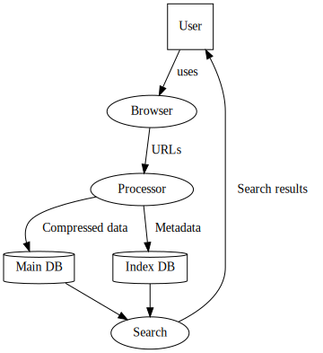

# Archiweb - Local internet archive

#  **WORK IN PROGRESS** 

## Pipeline
* Browser plugin - Collects URLs to store
* Processor - Compresses data and extracts indexing info
* Index database - Search indexes for data
* Search - Web service that can be used to retrieve some data
* Main database - Original data, compressed

## Implementation roadmap

* MVP: Browser plugin + passtrough processor + index database + minimal search = Better browser history
* Main database: Actual archival
* Proper compression for multiple formats
* Better search:
    * by datatype
    * by date saved
    * by date edited
    * with synonyms
* Hardcoded site optimizations / features
    * Youtube-dl
    * Facebook messages
    * Whatsapp web, Telegram web
* Per-site preferences
* "Pagerank" - link-chain proximity
* Recursively look into links
* Index images by detecting image contents
* Cache sharing with other people
    * Requires "public/private" flag in data
    * Only with user-selected people in the beginning